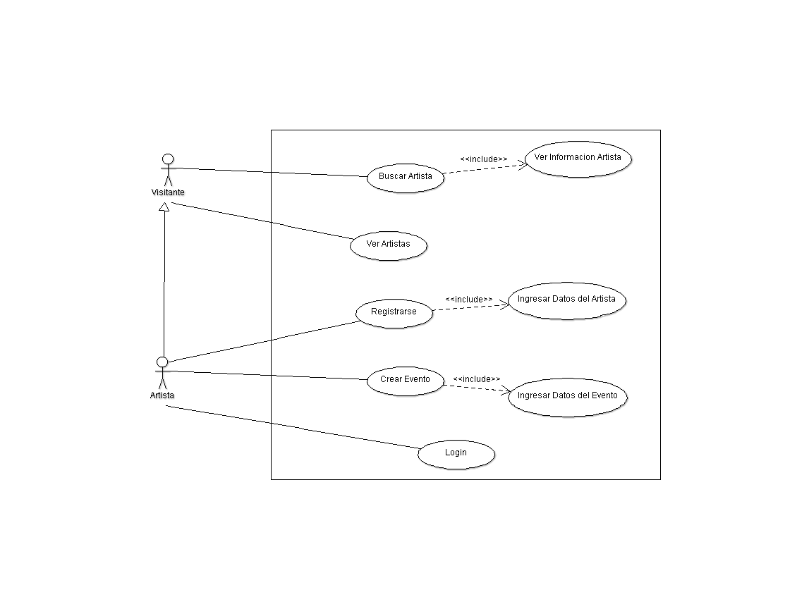

Diseño de la aplicacíon
=======================

Casos de Uso
------------

.. _referencia-a:

Modulo Artistas
^^^^^^^^^^^^^^^
Diagrama caso de uso, en el cual muestra como están organizadas las acciones
que puede efectuar un visitante o Artistas, en el diagrama se muestra que artista hereda
de Visitante esto quiere decir que el artista podrá buscar a otros artistas.

.. _referencia-e:

Modulo Eventos
^^^^^^^^^^^^^^^
Diagrama caso de uso, se muestran las acciones que puede realizar un visitante
y un artista, los artistas podrán visualizar los eventos ya creados así como crearlos.

.. image:: diagramas/DiagramaEvento.png
 :height: 15cm
 :width: 15cm
 :scale: 100%
 :align:  center

.. _referencia-i:

Modulo Espacio Informativo
^^^^^^^^^^^^^^^^^^^^^^^^^^
Diagrama caso de uso, se muestra que un administrador cargara o actualizara información
estará visible tanto para visitantes como para artistas, la información tratara sobre
temas culturales de Quetzaltenango.

.. image:: diagramas/DiagramaEspacio.png
 :height: 15cm
 :width: 15cm
 :scale: 100%
 :align:  center

.. _referencia-ad:

Modulo Administracion
^^^^^^^^^^^^^^^^^^^^^
Diagrama caso de uso, se muestra lo que puede hacer un administrador dentro del sistema,
la parte de generar estadísticas, serán generadas a partir de datos de los eventos, como
votación o comentarios, estas se enfocan en los eventos.

.. image:: diagramas/DiagramaAdministracion.png
 :height: 15cm
 :width: 15cm
 :scale: 100%
 :align:  center

Clases
------

Diagrama de BD
--------------

