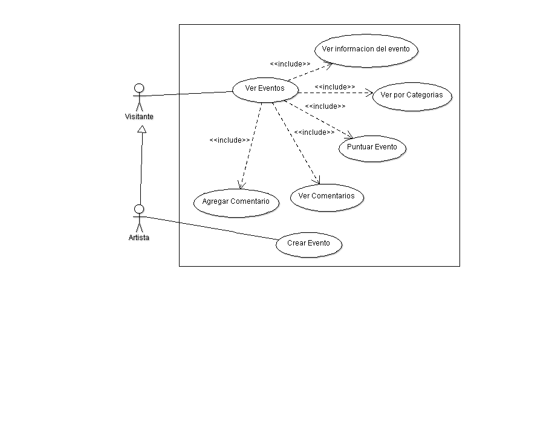

Diseño de la aplicacíon
=======================

Casos de Uso
------------
Caso General
^^^^^^^^^^^^
  .. figure:: diagramas/DiagramaGeneral.png
   :align:  center

.. _referencia-a:

Modulo Artistas
^^^^^^^^^^^^^^^
.. figure:: diagramas/DiagramaArtista.png
 :align:  center

.. _referencia-e:

Modulo Eventos
^^^^^^^^^^^^^^^

.. _referencia-i:

Modulo Espacio Informativo
^^^^^^^^^^^^^^^^^^^^^^^^^^

.. _referencia-ad:

Modulo Administracion
^^^^^^^^^^^^^^^^^^^^^
.. figure:: diagramas/DiagramaAdministracion.png
 :align:  center
Clases
------

Diagramas de clases y de sus distintas actividades, si fuese necesario.

Diagrama de BD
--------------

Diagrama de la Base de Datos que requerirá el software.
